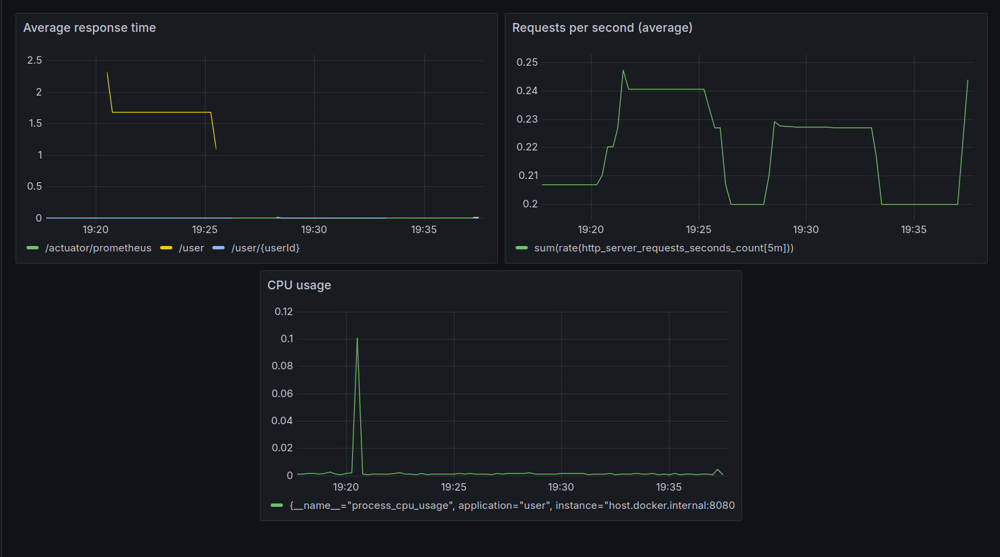
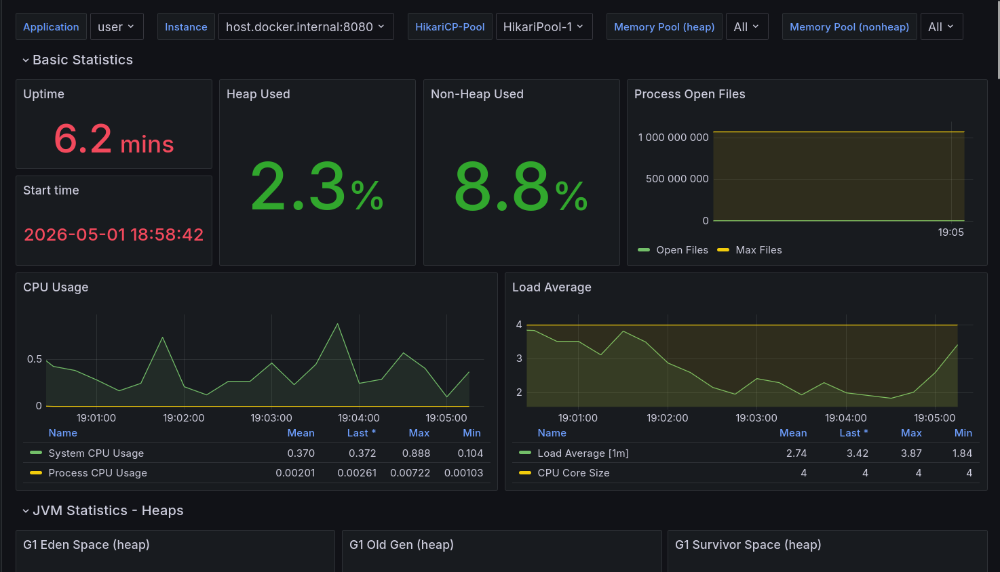

## ***Описание***
Простой CRUD-сервис для управления пользователями. Метод POST /user создает повышенную нагрузку  
на сервис с помощью "тяжелого" цикла.

Запуск в IntelliJ IDEA:
```bash
./mvnw spring-boot:run
```

Запуск в Docker:
```bash
docker build -t user-app .
docker run -p 8080:8080 -p 8000:8000 user-app
```

## ***Анализ потоков и памяти***

Данные получены путём запуска скрипта load.sh, который нагружает потоки, отправляя запросы  
на эндпоинт POST /user в течение 10сек.

### **Анализ нагрузки потоков**

Топ-3 потока по проценту нагрузки:
1. http-nio-8080-exec-20
2. http-nio-8080-exec-9
3. http-nio-8080-exec-16

| Название потока          | Время жизни потока (elapsed), с | Время работы потока (cpu_ms), мс | Процент нагрузки |
|--------------------------|---------------------------------|----------------------------------|------------------|
| http-nio-8080-exec-1     | 11,43                           | 1615,98                          | 14,14            |
| http-nio-8080-exec-2     | 11,43                           | 1135,00                          | 9,93             |
| http-nio-8080-exec-3     | 11,43                           | 1449,73                          | 12,68            |
| http-nio-8080-exec-4     | 11,43                           | 1471,22                          | 12,87            |
| http-nio-8080-exec-5     | 11,43                           | 1235,38                          | 10,81            |
| http-nio-8080-exec-6     | 11,43                           | 1471,99                          | 12,88            |
| http-nio-8080-exec-7     | 11,43                           | 1229,82                          | 10,76            |
| http-nio-8080-exec-8     | 11,43                           | 1344,84                          | 11,77            |
| http-nio-8080-exec-9     | 11,43                           | 1752,38                          | 15,33*           |
| http-nio-8080-exec-10    | 11,43                           | 1254,00                          | 10,97            |
| http-nio-8080-exec-11    | 11,43                           | 1384,24                          | 12,11            |
| http-nio-8080-exec-12    | 11,44                           | 1390,03                          | 12,15            |
| http-nio-8080-exec-13    | 11,43                           | 1424,44                          | 12,46            |
| http-nio-8080-exec-14    | 11,43                           | 1418,78                          | 12,41            |
| http-nio-8080-exec-15    | 11,43                           | 1394,26                          | 12,20            |
| http-nio-8080-exec-16    | 11,44                           | 1717,12                          | 15,01*           |
| http-nio-8080-exec-17    | 11,43                           | 1410,58                          | 12,34            |
| http-nio-8080-exec-18    | 11,43                           | 1337,60                          | 11,70            |
| http-nio-8080-exec-19    | 11,44                           | 1287,75                          | 11,26            |
| http-nio-8080-exec-20    | 11,43                           | 2114,65                          | 18,50*           |
| http-nio-8080-exec-21    | 11,43                           | 1427,08                          | 12,49            |

(Служебные потоки Java VM не указаны в таблице, т.к. их нагрузка не превышает 5-10%.)

### **Анализ дампа памяти**

Топ-5 классов по числу экземпляров:
1. byte[] (22,3%)
2. java.lang.String (21,8%)
3. java.util.concurrent.ConcurrentHashMap$Node (5,6%)
4. java.util.ArrayList (5,6%)
5. org.apache.maven.model.InputLocation (3,7%)

Топ-5 классов по размеру:
1. byte[] (34,4%)
2. java.lang.String (11,5%)
3. org.apache.maven.model.Dependency (5,7%)
4. java.lang.Object[] (4%)
5. java.util.concurrent.ConcurrentHashMap$Node (3,9%)

---

## ***Панели Graphana***

### ***Собственный дашборд***



| PromQL                                                                                                                    | Метрика                                    |
|---------------------------------------------------------------------------------------------------------------------------|--------------------------------------------|
| `sum by (uri) (rate(http_server_requests_seconds_sum[5m])) / sum by (uri) (rate(http_server_requests_seconds_count[5m]))` | Среднее время ответа по каждому эндпоинту  |
| `sum(rate(http_server_requests_seconds_count[5m]))`                                                                       | Общая число запросов в секунду (в среднем) |
| `process_cpu_usage`                                                                                                       | Использование CPU приложением              |

### ***Дашборд с Grafana dashboards***

